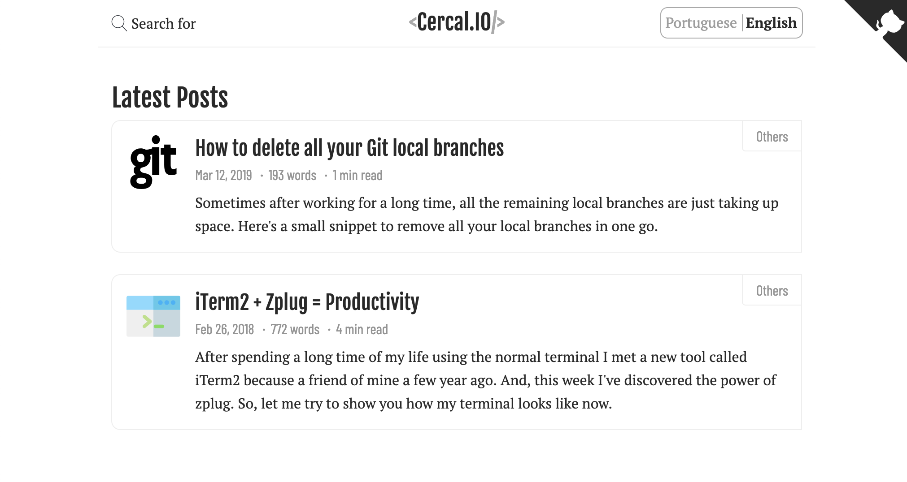

# cercal.io

## A brief history of time

> Yes, I know that this title remembers a book title by Stephen Hawking, but at this case it’s about my blog. =)

Well, everything started in 2010 when I decided to have a blog, it has been a long time and many different things happened to myself on the way, however, this is a complete redesign of an old [Symfony](https://symfony.com/) project, that was migrated to [PhalconPHP](https://phalconphp.com/en/), then to [Wordpress](https://wordpress.org/) and finally to text based application (which is the status quo today).

Thanks to all of you for following me through this crazy things called life, to all free services available nowdays on the internet and for the effort that I’ve put on it, now I don’t have to pay anything to have this project running except the domain `.io`.

This redesign which had started as a proof of concept is now live, what makes me really proud about the challenge that I’ve accepted a year ago. 

> This project will be with the *WIP* status for a long time, however, the major features are already in place and I encourage you to fork this repo.
> Follow us on [https://cercal.io/](https://cercal.io/), help us to maintain this project by supporting it. You can also give us a star or fork the project, this way we gain relevance in the community.

### Screenshots

Well, nothing better than a picture showing how the blog is rendered today, right? 



## Setup

Let’s move on and take a look what are the steps you have to do in order to have the project running locally on your development environment.

### Compiling the blog

The following script will build the blog according to the existing files on the repository, then it will listen to any changes in order to recompile the project.

Before doing so, you have to copy the file `.env.dist` and save it as `.env` while applying the changes according to your environment.

```
cp .env.dist .env
vi .env
```

> For the majority of things you have to do, the development compilation mode should be more than enough.
> If you are curious about the steps that are executed for each compilation mode, please take a look on the [Gruntfile.js](https://github.com/jpcercal/cercal.io/blob/master/Gruntfile.js) file.
> Otherwise, if you would like to take a look into our pipeline and check the compilation process for production, then take a look into the [.travis.yml](https://github.com/jpcercal/cercal.io/blob/master/.travis.yml) file and into the [TravisCI.org:jpcercal/cercal.io](https://travis-ci.org/jpcercal/cercal.io) pipeline.

```shell
$ ./bin/watch.sh
```

> Note that, the command above requires docker to be running on your machine.

If everything went okay, it’s time to open your browser to see everything running [https://jpcercal.local](https://jpcercal.local).

> It assumes that the hostname defined on the `.env` file is still the default one `"jpcercal.local"`. 
