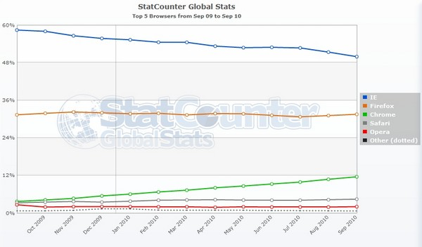

O [navegador]( "Navegadores ou Browsers") **Internet Explorer**, 
da Microsoft, teve menos de 50% de participação no mercado no mês de setembro, registrando a maior baixa de sua 
história. De acordo com a empresa de análise de mercado [StatCounter](http://statcounter.com/ "StatCounter"), o uso 
global do browser foi de 49,87%, número bastante inferior se comparado quando o programa venceu a batalha contra o 
[Netscape]( "Navegadores ou Browsers") na década de 90, conquistando 
a maioria do mercado.

A _StatCounter_ ainda afirma que o _Firefox_, da _Mozilla_, em segundo lugar, tem 31,5% do mercado de navegadores 
enquanto o _Chrome_, do _Google_, está em terceiro, com 11,54%. Entretanto, o programa triplicou o seu uso desde o 
mesmo período do ano passado. Segundo relatório do site _Softpedia_, o _Chrome_ é o navegador de mais rápido crescimento. 
O restante do mercado é dividido em browsers com menor participação como o _Opera_ e o _Safari_, da _Apple_.

Há dois anos, o _Internet Explorer_ tinha dois terços do mercado de _browsers_ e a empresa de análise acredita que 
nem a nova versão, o _IE 9_, seja capaz de reverter a situação.

O CEO da _StatCounter_, Aodhan Cullen, disse em comunicado que _"este é um grande momento na guerra dos navegadores"_. 
_"Acredito que o acordo que a Microsoft fez com a União Europeia, de permitir que os usuários escolhessem seus 
navegadores no Windows, contribuiu para esta baixa do Internet Explorer"_.

Fonte: [G1](http://g1.globo.com/tecnologia/noticia/2010/10/internet-explorer-tem-menos-de-50-da-participacao-de-mercado.html "G1")
